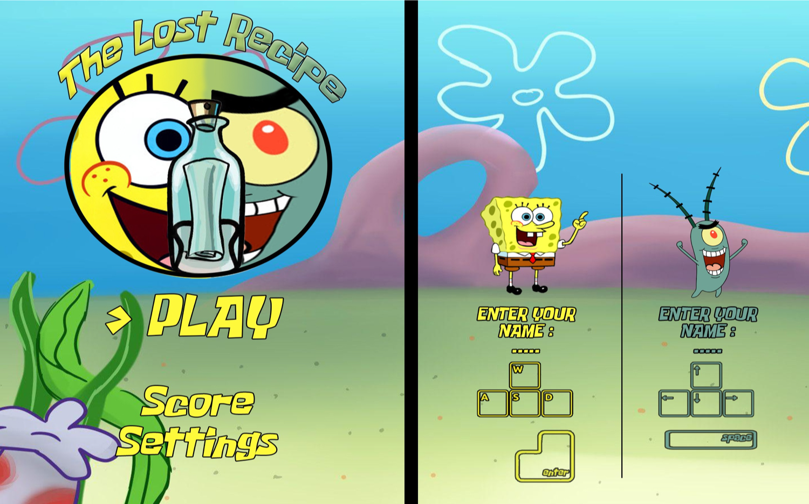
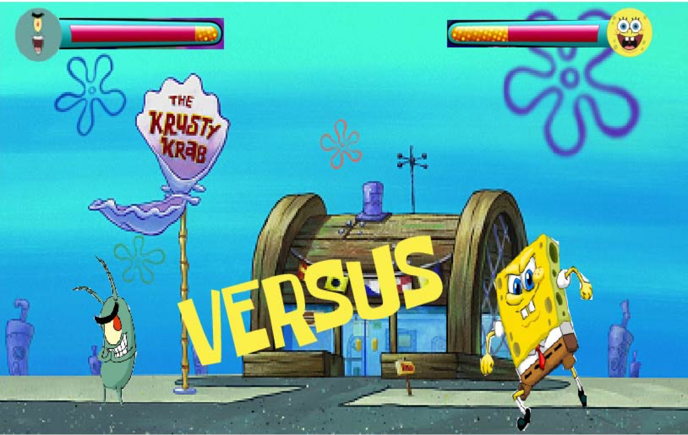

# The Story Of The Game:

##### The Lost Recipe is a multiplayer game composed of 3 levels each one representing different types of games:

##### The first level: is an adventurous game where the two characters Bob and Plankton.

##### The Second level: is a maze.

##### The third level : a battle game.

##### The goal of the game : the first who will get the recipe will be the winner.

# Description of the Game:

We made this game using the programming language 'C' .

 To manage the build process , we used the Open Source System 'CMake'. 

To create our 2D game, we chose SDL2 as a cross-platform library for the game development.

